# Trading Strategy Research & Verification Instructions

This document outlines the design, testing procedures, and strategy matching rules for the Regime-Switching Mean Reversion & Trend Following trading indicator project.

---

## 1. Project Objective

The goal is to develop a MetaTrader 5 (MT5) Custom Indicator and Expert Advisor (EA) that dynamically switches its execution logic between **Mean Reversion (MR)** and **Trend Following (TF)** based on the detected market regime.
* **Target Win Rate (WR)**: 70% – 80%
* **Target Profit Factor (PF)**: $\ge 1.8$
* **Target Drawdown**: $< 15\%$

---

## 2. Historical CSV Data Guidelines

Historical 5-minute bar CSV files are used for all strategy research and testing.
* **CSV Format**: Files are named `<SYMBOL>_5min_1year.csv` (e.g., `BTCUSDT_5min_1year.csv`).
* **Essential Columns**:
  * `datetime`: Index parsed as timestamps and sorted chronologically.
  * `open`, `high`, `low`, `close`: OHLC price bars.
  * `volume`: Tick/transaction volume.
* **Execution Safety**:
  * All indicator calculations must be shifted by 1 bar (`.shift(1)` or indexing index-1) before generating signals to prevent **lookahead bias**.
  * Signals generated at the close of bar $i$ are executed at the open of bar $i+1$.

---

## 3. Backtesting Methodologies

### Standard Backtest
Runs on the full historical CSV dataset.
1. **Entry**: Executed on the next bar's `open` price after a signal is generated.
2. **Exits**:
   * **Stop Loss (SL)**: Calculated using an ATR multiplier. Triggers if the low (long) or high (short) touches the SL level.
   * **Take Profit (TP)**: Calculated using an ATR multiplier. Triggers if the high (long) or low (short) touches the TP level.
   * **Time-based**: Positions are automatically closed at the close of the $N$-th bar if neither SL nor TP is hit (e.g., max 48 bars / 4 hours).
3. **Risk Management**: Capital-risk-based position sizing. Risks a fixed percentage (e.g., 1.0%) of the current account balance per trade based on the distance to the SL.

### Walk-Forward Testing
Prevents curve-fitting (over-optimization) by splitting the data:
* **In-Sample (IS - 70%)**: The training period. Strategy parameters are swept and optimized here to locate the highest PF and WR.
* **Out-of-Sample (OOS - 30%)**: The validation period. The optimal parameters from the IS period are applied to this forward data.
* **Validation Rule**: A strategy is considered robust if its OOS Profit Factor is $\ge 1.2$ and the performance decay (IS PF minus OOS PF) is minimal.

---

## 4. Strategy & Indicator Matching Matrix

The framework classifies market conditions into two regimes: **Ranging** and **Trending**.

```mermaid
graph TD
    A[Market Price Data] --> B{Regime Detection}
    B -- Choppiness > 50 or ADX < 25 --> C[Mean Reversion Strategy]
    B -- Choppiness < 50 and ADX > 25 --> D[Trend Following Strategy]
    
    C --> C1[Oscillators: RSI / StochRSI / CCI]
    C --> C2[Bands: Bollinger / Keltner / Z-Score]
    C --> C3[Trigger: Buy Oversold, Sell Overbought]
    
    D --> D1[Filters: EMAs / KAMA / ALMA / VWAP]
    D --> D2[Breakouts: Donchian Channel / SuperTrend]
    D --> D3[Trigger: Buy High Breakouts, Sell Low Breakouts]
```



### Mean Reversion (Ranging Markets)
* **Regime Definition**: Choppiness Index > 50 OR ADX < 25.
* **Indicator Alignment**:
  * **Channel/Extreme Indicators**: Bollinger Bands %B, Keltner Channel %B, or Z-Score.
  * **Momentum Oscillators**: RSI, Stochastic RSI, CCI, or Williams %R.
* **Intelligent Rules**:
  * **Long Setup**: Price reaches channel bottom (Close $\le$ Bollinger Lower Band / Z-Score < -2) while oscillators indicate oversold levels (StochRSI < 15, RSI < 40).
  * **Short Setup**: Price reaches channel top (Close $\ge$ Bollinger Upper Band / Z-Score > 2) while oscillators indicate overbought levels (StochRSI > 85, RSI > 60).

### Trend Following (Trending Markets)
* **Regime Definition**: Choppiness Index < 50 AND ADX > 25.
* **Indicator Alignment**:
  * **Trend Filters**: EMAs (e.g. 20, 50, 200), Kaufman's Adaptive Moving Average (KAMA), Arnaud Legoux Moving Average (ALMA), or VWAP.
  * **Breakout Bands**: Donchian Channels (upper/lower bounds) or SuperTrend.
* **Intelligent Rules**:
  * **Long Setup**: Price breaks above the $N$-period Donchian Channel High, SuperTrend is bullish (value below price), and the short-term EMA/ALMA is above the long-term EMA/KAMA/VWAP.
  * **Short Setup**: Price breaks below the $N$-period Donchian Channel Low, SuperTrend is bearish (value above price), and the short-term EMA/ALMA is below the long-term EMA/KAMA/VWAP.

---

## 5. Running the Python Research Framework

To search for profitable strategy configurations across the historical CSVs:

1. **Install Dependencies**:
   ```powershell
   pip install -r requirements.txt
   ```
2. **Download Historical Data** (If needed):
   ```powershell
   python download_mt5_data.py
   ```
3. **Execute Strategy Search** (Mean Reversion and Trend Following simultaneously):
   ```powershell
   python run_search_bots.py
   ```
   * *Quick validation test (runs 50 combinations)*:
     ```powershell
     python run_search_bots.py --test
     ```

Results and parameter combinations meeting the target thresholds are outputted as JSON files (`mr_winning_strategies.json` and `tf_winning_strategies.json`), which can be imported directly into the MT5 Custom Indicator and EA.
